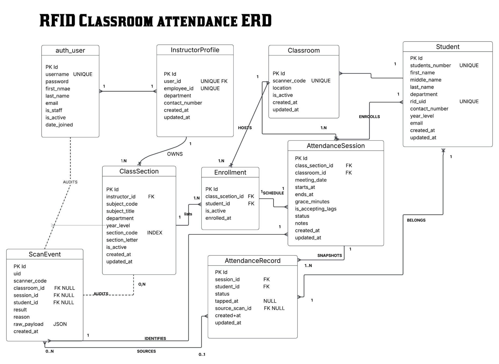
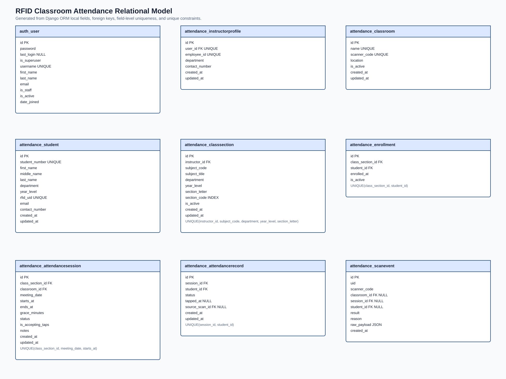

a. Introduction

# RFID Classroom Attendance Logging System

## Introduction
This project is a classroom attendance monitoring system using passive RFID technology integrated with a Django-based web application and an Arduino RC522 RFID reader. The project is built using Django, MySQL/MariaDB, Tailwind CSS, Python serial communication, and Arduino hardware integration. Features include CSV roster import, attendance sessions management, scan event auditing, authentication and dashboard for reporting. 

The project allows instructors to manage class sections, student rosters, and attendance sessions through a centralized dashboard while automatically recording attendance through RFID card scanning. When students tap their RFID-enabled school IDs on the scanner, the system validates the scanned UID, checks active attendance session, and records present, late, or absent. All scan events are logged in real time and stored in a MySQL-compatible database for monitoring, reporting, and export purposes.

### Background

Many schools still record attendance manually using paper-based list or spreadsheet encoding. An average of 30 minutes could be wasted in a single class calling names manually for attendance and marking attendance sheets. This methods take time away from instruction, creates transcription errors that cannot fully verify whether students remain in the premise the whole time affecting both academic and students safety. 

The project replaces the manual workflow with a Python-based database application. Instructors can create class sections and attendance sessions, while students tap RFID-enabled school IDs on an Arduino RC522 scanner. The system then records whether each enrolled student is present, late, or absent.

### Problem Statement
The traditional pen-and-paper attendance process is slow, repetitive, and difficult to verify. Instructors need a system that can:

- Manage class rosters efficiently
- Open and manage attendance windows
- Automatically log RFID taps
- Display present, late, and absent students in real time
- Provide searchable and exportable attendance records

### Scope
The project includes:

- Instructor authentication and login
- Class section management
- Student roster CRUD operations
- CSV roster import
- Attendance session creation
- RFID scan logging through a Python bridge
- Dashboard reporting and tabular views
- Search and CSV export functionality
- Database schema files and seed data
- ERD and relational model diagrams

 Staff users can also manage the core database records through both the Django admin panel and the application's custom management views.

The project does not include:

- Student login
- SMS or email notifications
- Offline scan queues
- Biometric verification
- Production deployment hardening. 

### Target Users

The primary users are instructors who manage class rosters and attendance sessions. A Django administrator creates instructor accounts and can manage database records through the Django admin panel.

---

b. Project Objectives

## Project Objectives

Develop a Python-based MySQL-compatible database application that stores, updates, and displays classroom attendance records through a user-friendly web interfac

## Secondary Objective

- Connect Django to XAMPP MySQL or MariaDB using Django's MySQL backend and `mysqlclient`
- Provide CRUD operations for:
  - Class sections
  - Students
  - Enrollments
  - Attendance sessions
  - Classrooms
  - Scan events
  - Attendance records
- Integrate an Arduino RC522 RFID serial bridge with Django
- Validate:
  - Departments
  - Year levels
  - Section letters
  - Unique RFID UIDs
  - Active attendance windows
- Provide search functionality for students and class sections
- Export attendance results to CSV
- Include:
  - Database schema
  - Seed data
  - ERD
  - Relational model
  - Setup documentation

---

c. Business Rules

## Business Rules

### Detailed Business Logic

- Admins create Django `User` accounts and matching `InstructorProfile` records through Django admin.
- Instructors can only manage class sections and sessions assigned to their instructor profile.
- Student records contain:
  - `first_name`
  - optional `middle_name`
  - `last_name`
  - department
  - year level
  - unique RFID UID
- Valid departments:
  - `BSCS`
  - `BSIT`
  - `BSIS`
  - `BLIS`
- Class section codes follow the format:
  - `DEPARTMENT-YearSection`
  - Example: `BSCS-2A`
- Section letters are limited to `A-Z`
- Year levels are limited to `1-4`
- Creating an attendance session automatically snapshots enrolled students as initially absent.
- RFID taps are only accepted while attendance is open.
- Taps are routed to the earliest active session containing the scanned student.
- Taps before the grace period ends are marked as `present`.
- Taps after the grace period but before session end are marked as `late`.
- Students without accepted taps remain absent.
- Duplicate taps are logged but do not overwrite the first attendance record.
- Invalid or out-of-window taps are rejected but still recorded in `ScanEvent`.
- The bridge must send:
  - `X-Bridge-Key`
  - scanned `uid`

### Constraints
- Python 3.x application
- Django full-stack framework using Django templates
- Tailwind CSS compiled locally
- Bootstrap is not used
- Requires a MySQL-compatible database engine
- Default database name: `CCCS105`

Sensitive values such as:

- `SECRET_KEY`
- database password
- `BRIDGE_KEY`

are stored in `.env`.

Arduino RC522 bridge expects serial lines in the format:

```text
UID:<HEX_OR_ALPHANUMERIC_TOKEN>
```

### Conditions

- Users must be authenticated before accessing the instructor dashboard.
- Instructor accounts without `InstructorProfile` records are denied access.
- Attendance sessions must:
  - be open
  - accept taps
  - include the scanned RFID UID in the roster
- Attendance sessions must have a valid time range.
- Django backend must be running before the bridge can submit scans.

---

d. Database Models

## Database Models

### Entity Relationship Diagram



Main relationships:

- `InstructorProfile` owns many `ClassSection` records.
- `ClassSection` has many `Enrollment` records and many `AttendanceSession` records.
- `Student` joins class sections through `Enrollment`.
- `AttendanceSession` belongs to one `Classroom`.
- `AttendanceRecord` stores one student's status for one attendance session.
- `ScanEvent` stores every raw bridge scan outcome.

### Relational Model



Tables and attributes:

- `auth_user`: `id` PK, `password`, `last_login` nullable, `is_superuser`, `username` unique, `first_name`, `last_name`, `email`, `is_staff`, `is_active`, `date_joined`.
- `attendance_instructorprofile`: `id` PK, `user_id` FK unique, `employee_id` unique, `department`, `contact_number`, `created_at`, `updated_at`.
- `attendance_classroom`: `id` PK, `name` unique, `scanner_code` unique, `location`, `is_active`, `created_at`, `updated_at`.
- `attendance_student`: `id` PK, `student_number` unique, `first_name`, `middle_name`, `last_name`, `department`, `year_level`, `rfid_uid` unique, `email`, `contact_number`, `created_at`, `updated_at`.
- `attendance_classsection`: `id` PK, `instructor_id` FK, `subject_code`, `subject_title`, `department`, `year_level`, `section_letter`, `section_code`, `is_active`, `created_at`, `updated_at`; unique on `instructor_id`, `subject_code`, `department`, `year_level`, `section_letter`.
- `attendance_enrollment`: `id` PK, `class_section_id` FK, `student_id` FK, `enrolled_at`, `is_active`; unique on `class_section_id`, `student_id`.
- `attendance_attendancesession`: `id` PK, `class_section_id` FK, `classroom_id` FK, `meeting_date`, `starts_at`, `ends_at`, `grace_minutes`, `status`, `is_accepting_taps`, `notes`, `created_at`, `updated_at`; unique on `class_section_id`, `meeting_date`, `starts_at`.
- `attendance_attendancerecord`: `id` PK, `session_id` FK, `student_id` FK, `status`, `tapped_at` nullable, `source_scan_id` FK nullable, `created_at`, `updated_at`; unique on `session_id`, `student_id`.
- `attendance_scanevent`: `id` PK, `uid`, `scanner_code`, `classroom_id` FK nullable, `session_id` FK nullable, `student_id` FK nullable, `result`, `reason`, `raw_payload` JSON, `created_at`.

The listed schema covers the application tables plus `auth_user`. Django creates additional framework support tables, such as sessions, permissions, and content types, when `python manage.py migrate` runs.

---

e. Project Overview

## Project Overview

The application follows Django's MTV pattern, which is Django's variant of MVC:

- Models define the MySQL-compatible schema and business rules.
- Templates render the instructor dashboard and CRUD pages.
- Views handle instructor workflows and bridge API requests.
- The serial bridge is a separate Python process that reads the Arduino RC522 scanner and posts scan JSON to Django.

Key components:

- `attendance/models.py`: database entities, constraints, and roster snapshot signals.
- `attendance/views.py`: dashboard, CRUD views, CSV import/export, and `/api/scan/`.
- `attendance/services.py`: scan-processing business logic.
- `bridge/bridge.py`: Arduino serial to HTTP bridge.
- `database/schema.sql`: MariaDB-oriented schema.
- `database/initial_data.sql`: exported demo seed rows.

---

f. Setup Instructions

## Setup Instructions

### Prerequisites

- Git for cloning the repository.
- Arch Linux, XAMPP on Windows, or another environment with a MySQL-compatible server.
- Python 3.14 or compatible Python 3.x supported by the installed Django version.
- Node.js and npm for Tailwind CSS.
- MySQL or MariaDB server and client headers.
- Arduino Uno with RC522 RFID reader for hardware testing.

Install system packages on Arch Linux:

```bash
sudo pacman -S git python python-pip mariadb nodejs npm base-devel
```

For XAMPP on Windows, start Apache is not required for this Django app, but MySQL must be running from the XAMPP Control Panel. The default assignment database configuration is:

```text
Host: localhost
Port: 3306
Database: CCCS105
Username: root
Password: empty
```

Initialize and start MariaDB on Arch Linux if it is not already configured:

```bash
sudo mariadb-install-db --user=mysql --basedir=/usr --datadir=/var/lib/mysql
sudo systemctl enable --now mariadb
sudo mariadb-secure-installation
```

Create the database:

```bash
sudo mariadb -u root -p
```

```sql
CREATE DATABASE IF NOT EXISTS CCCS105 CHARACTER SET utf8mb4 COLLATE utf8mb4_unicode_ci;
FLUSH PRIVILEGES;
EXIT;
```

For a non-XAMPP local MariaDB setup, you may create a dedicated application user instead of using `root`:

```sql
CREATE USER IF NOT EXISTS 'cccs105_user'@'localhost' IDENTIFIED BY 'change-this-password';
GRANT ALL PRIVILEGES ON CCCS105.* TO 'cccs105_user'@'localhost';
FLUSH PRIVILEGES;
```

### Installation

```bash
git clone <repository-url>
cd infomanage
python -m venv .venv
source .venv/bin/activate
pip install -r requirements.txt
npm install
cp .env.example .env
```

Edit `.env`:

```env
DB_ENGINE=mysql
DB_NAME=CCCS105
DB_USER=root
DB_PASSWORD=
DB_HOST=localhost
DB_PORT=3306
BRIDGE_KEY=change-me-bridge-key
```

Use the dedicated application user values if you created one instead of using the XAMPP default account.

Run migrations, seed data, and build CSS:

```bash
python manage.py migrate
python manage.py seed_demo_data
npm run build:css
```

The Django migration path above is the recommended way to create the working database. If your instructor needs the SQL-file import path, import the included files into MySQL/MariaDB from the repository root:

```bash
mysql -u root < database/schema.sql
mysql -u root < database/initial_data.sql
```

Create an admin account if needed:

```bash
python manage.py createsuperuser
```

---

g. Team Members & Roles and Responsibilities

## Team Members & Roles

| Name | GitHub Username | Role | Responsibilities |
|------|------|------|------------------|
| Martinez John Benedict | @execuu | Lead Backend Developer | Developed the Django backend, RFID scan processing, database integration, CRUD operations, and system functionality |
| Gornal Ronnith | @ronndc | Documentation and Project Planning | Prepared the README documentation, project planning, system analysis, business rules, and project organization |
| Rocil Dane Jesimiell | @Dane-15 | Database Designer and Diagram Developer | Designed the ERD, relational model, database structure, and assisted in schema development |

---

h. Dependencies

## Dependencies

Python packages:

- `Django>=6.0,<6.1`
- `mysqlclient>=2.2`
- `python-dotenv>=1.0`
- `pyserial>=3.5`
- `requests>=2.31`
- `pytest>=9.0`
- `pytest-django>=4.12`
- `responses>=0.25`
- `Pillow>=12.0`

Bridge-only packages:

- `pyserial>=3.5`
- `evdev>=1.7` on Linux keyboard-reader setups
- `requests>=2.31`
- `python-dotenv>=1.0`

Node packages:

- `tailwindcss^4.2.4`
- `@tailwindcss/cli^4.2.4`

System requirements:

- MySQL 8.x, MariaDB 10.x, or XAMPP MySQL with InnoDB and `utf8mb4` support.
- Modern browser.
- Arduino serial driver access to `/dev/ttyACM0`, `/dev/ttyUSB0`, or equivalent.

---

i. Running Instructions

## Running Instructions

Start Django:

```bash
source .venv/bin/activate
python manage.py runserver
```

Open:

```text
http://127.0.0.1:8000/
```

Default seeded instructor login:

```text
Username: instructor01
Password: InstructorPass123!
```

Admin panel:

```text
http://127.0.0.1:8000/admin/
```

### Using the Application

1. Log in as an instructor.
2. Create or open a class section.
3. Add students manually or paste CSV data through Import Roster.
4. Create an attendance session with classroom, start time, end time, and grace minutes.
5. Open attendance for the session, then run the bridge while the session is accepting taps.
6. Watch the session page update with present, late, absent, and scan audit data.
7. Export the attendance result as CSV when needed.

### Running the Bridge

```bash
cd bridge
python -m venv .venv
source .venv/bin/activate
pip install -r requirements.txt
cp .env.example .env
```

Edit `bridge/.env`:

```env
READER_MODE=serial
SERIAL_PORT=/dev/ttyACM0
BAUD_RATE=9600
DJANGO_URL=http://localhost:8000
BRIDGE_KEY=change-me-bridge-key
```

Run:

```bash
python bridge.py
```

The Arduino should print lines like:

```text
UID:A1B2C3D4
```

The bridge posts:

```json
{ "uid": "A1B2C3D4" }
```

### Stopping the Application

- Stop Django with `Ctrl+C`.
- Stop the bridge with `Ctrl+C`.
- Stop MariaDB if needed:

```bash
sudo systemctl stop mariadb
```

## Database Files

- `database/schema.sql`: MariaDB/MySQL schema for the application tables.
- `database/initial_data.sql`: exported seed rows.

The canonical way to create the database remains:

```bash
python manage.py migrate
python manage.py seed_demo_data
```

## Verification Commands

```bash
DB_ENGINE=sqlite python manage.py test attendance
DB_ENGINE=sqlite python manage.py check
npm run build:css
PYTHONPATH=bridge python -m pytest -q bridge
python scripts/render_db_diagrams.py
```
## YouTube Demonstration

Project demonstration video:

https://youtu.be/BDKPqauBURU?si=mkUwpFaW3aPGIGzi 